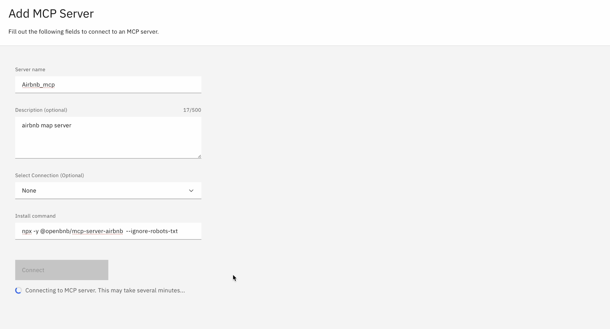
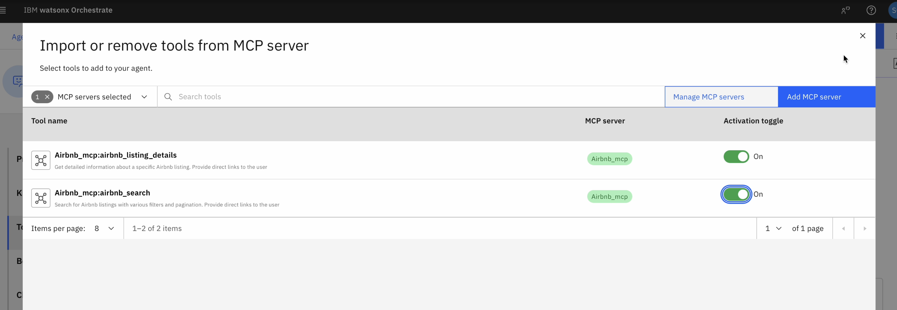

Add airbnb MCP server via following method:

Then add the tools by toggling on.

Ask the question e.g.

- Give me listings for tokyo for 5 nights and 2 adults

Source: https://mcp.so/server/airbnb-mcp-server/openbnb-org?tab=tools