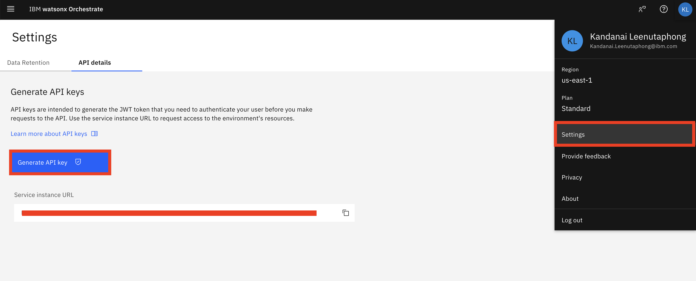

### Installation of dependencies
Install and create a virtual environment from `requirement.txt`. Ensure your python version is 3.11

Run the following command

```
python -m venv venv
source venv/bin/activate
uv pip install -r requirement.txt
```

### Activating watsonx Orchestrate environment
Assuming your are running watsonx Orchestrate on AWS Cloud (Saas),
Please get your credentials from 
```
orchestrate env list
orchestrate env add -n test-env -u <Service instance URL>
orchestrate env activate test-env
(Then enter API Key)
```
